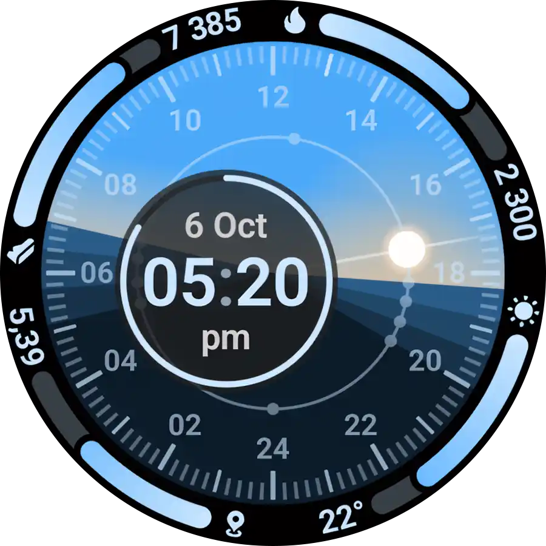
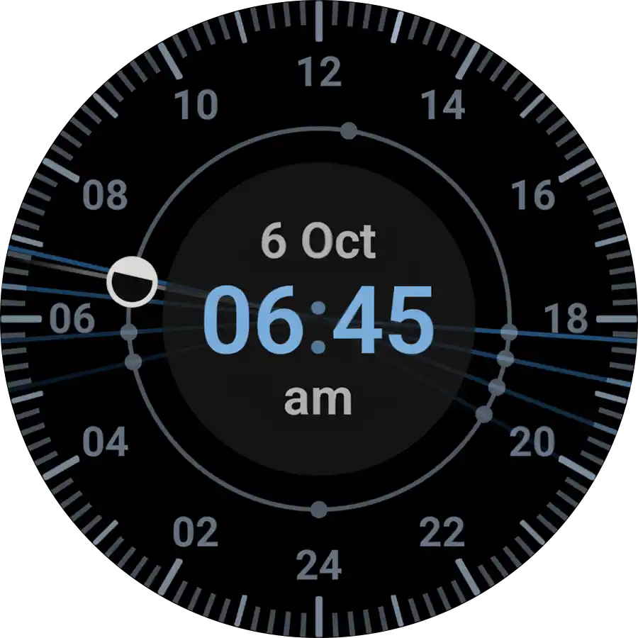
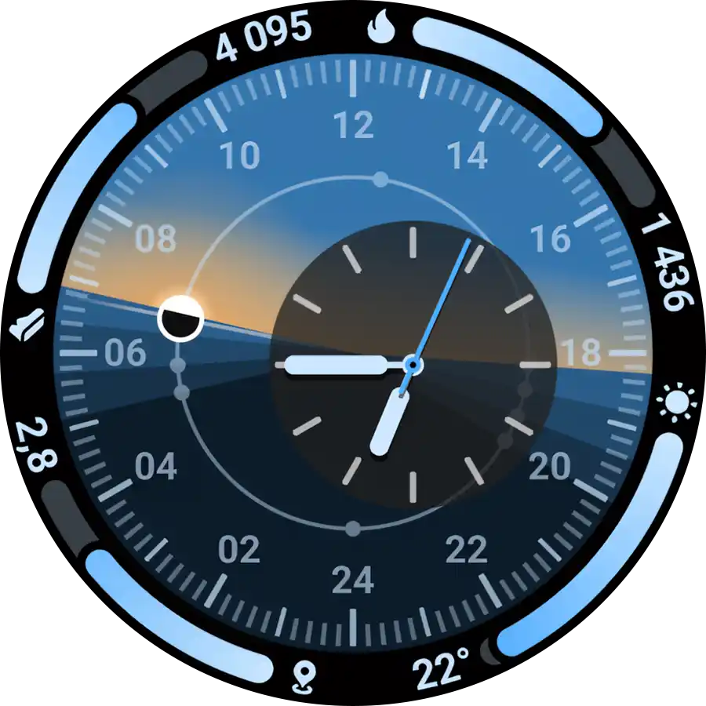
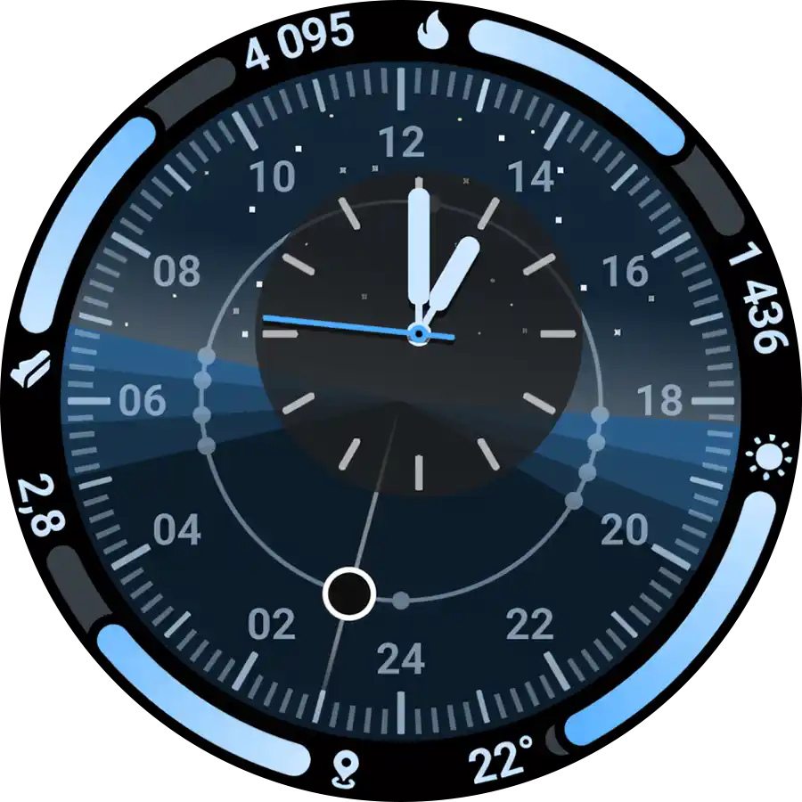
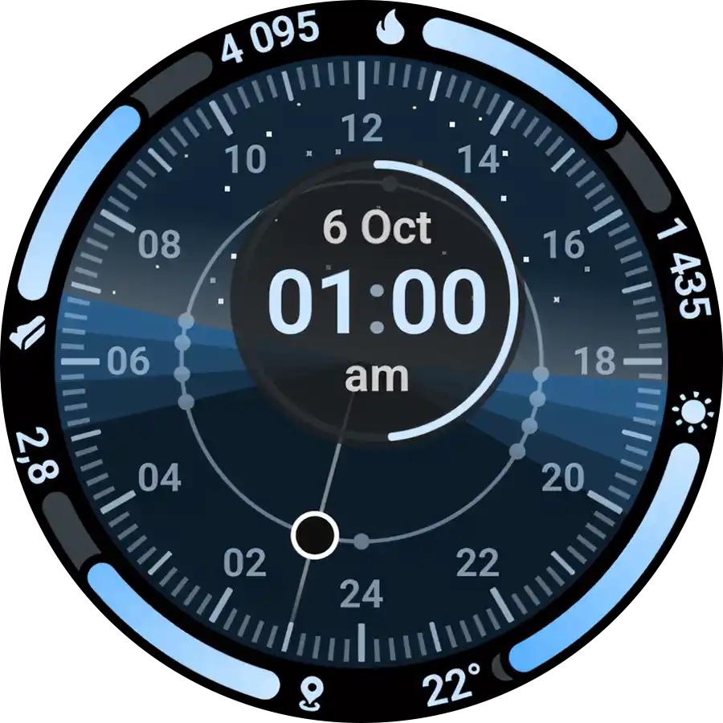
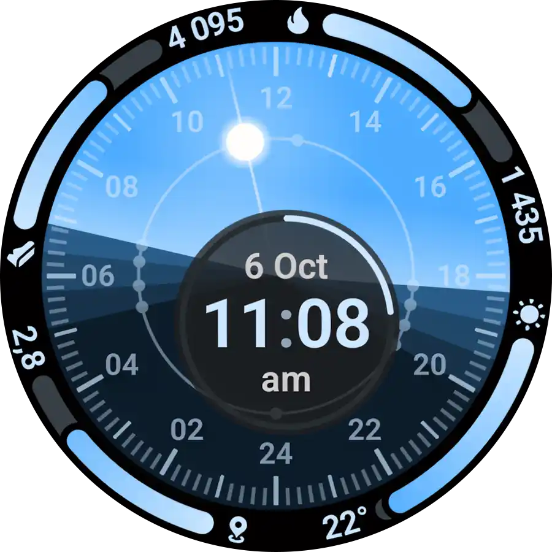

#  Solar Path Watch Face for Wear OS

[](https://github.com/amoledwatchfaces/Solar-Path-Watch-Face-Wear-OS/actions/workflows/build-and-release.yml)
[-brightgreen?logo=android&logoColor=white)](https://developer.android.com/wear)
[](https://developer.android.com/training/wearables/wff)
[](https://developer.android.com)
[](https://developer.android.com/training/wearables/compose)
[](https://github.com/amoledwatchfaces/Solar-Path-Watch-Face-Wear-OS/releases)
[](https://amoledwatchfaces.github.io/apps/privacy/solarpath.html)

**Solar Path** is an astronomically accurate 24-hour solar dial watch face and companion application for Wear OS, inspired by iconic celestial timepieces and classic 24-hour astronomical dials. It dynamically tracks the sun's passage across the celestial vault and relative to your local horizon—illustrating daylight, twilight phases, and nighttime with mathematical precision.

Developed with ❤️ by **[amoledwatchfaces™](https://amoledwatchfaces.com/)**.

---

<p align="center">
  
  
  
</p>
<p align="center">
  
  
  
</p>

---

## ✨ Features

- **24-Hour Circular Solar Dial**:
  - Solar noon at zenith (top / 12 o'clock / 0°).
  - Solar midnight at nadir (bottom / 6 o'clock / 180°).
  - Real-time celestial sun marker orbiting along the 24-hour circumference with an atmospheric radiating solar beam.
- **Accurate Twilight & Night Arcs**:
  - **Daylight**: Sun elevation > 0°
  - **Civil Twilight**: 0° to -6°
  - **Nautical Twilight**: -6° to -12°
  - **Astronomical Twilight**: -12° to -18°
  - **Night**: < -18°
- **Dynamic Atmosphere & Lighting**:
  - Day / night disk with smooth alpha transitions based on solar elevation ($\pm 15^\circ$ horizon threshold).
  - Dynamic sky hue adjusting smoothly through civil dusk and dawn.
  - Subtle starlight field emerging across the upper celestial quadrant after dusk.
- **Dual Clock Modes**:
  - **Digital Clock**: Clean, modern digital readout with optional leading zeros and alternate accent colors.
  - **Analog Clock**: Sleek hour, minute, and second hands with hour indices and date indicator.
- **Watch Face Format (WFF v4)**:
  - Declarative XML rendering natively on the Wear OS system with zero background battery drain (`hasCode = false`).
  - Standalone WFF APK bundled inside the companion app and delivered via **AndroidX Watch Face Push** (`androidx.wear.watchfacepush`).

---

## 🧭 Complication Slots

Solar Path features **4 customizable outer arc complication slots** around the dial perimeter, plus an internal communication slot powering the astronomical engine:

| Slot ID | Type / Position | Angle Span | Supported Complication Types | Default Provider |
|:---:|:---|:---:|:---|:---|
| **0** | **Internal Data Bridge** *(Center)* | N/A | `SHORT_TEXT`, `EMPTY` *(Non-editable)* | **Solar Path Complication Service** (Encodes real-time solar milestone angles) |
| **1** | **Top-Left Arc** | 270° → 360° | `RANGED_VALUE`, `LONG_TEXT`, `SHORT_TEXT`, `EMPTY` | Daily Steps (`Fitbit` / `Samsung Health` / `STEP_COUNT`) |
| **2** | **Top-Right Arc** | 0° → 90° | `RANGED_VALUE`, `LONG_TEXT`, `SHORT_TEXT`, `EMPTY` | Active Calories / UV Index / Battery (`WATCH_BATTERY`) |
| **3** | **Bottom-Right Arc** | 90° → 180° | `RANGED_VALUE`, `LONG_TEXT`, `SHORT_TEXT`, `EMPTY` | Current Weather (`Google Weather`) / `NEXT_EVENT` |
| **4** | **Bottom-Left Arc** | 180° → 270° | `RANGED_VALUE`, `LONG_TEXT`, `SHORT_TEXT`, `EMPTY` | Distance / Precipitation / Battery (`WATCH_BATTERY`) |

> [!NOTE]
> **Complication Slot 0** is strictly non-editable (`isCustomizable="FALSE"`). It serves as the internal real-time communication channel between the Solar Path companion service and the Watch Face Format dial. It dynamically injects solar milestone coordinates (sunrise, sunset, dusk, dawn, solar noon, and nadir) directly into the dial's rendering pipeline.

---

## 🎨 Customizations & Styles

Solar Path offers extensive customization options available directly in the Wear OS watch face picker and companion settings:

- **Primary, Secondary & Tertiary Themes**: Over 70+ meticulously curated color palettes (Atmospheric Blue, Graphite, Alpine Green, Deep Ocean, Sunset Orange, Solar Gold, Cyberpunk Neon, Terracotta, and more).
- **Clock Style**:
  - `Digital`: Crisp modern digital time readout.
  - `Analog`: Elegant minimalist analog hands and indices.
- **Clock Background**:
  - `Dark`: Solid contrast background disk behind the center dial.
  - `Transparent`: Clean, see-through dial showing the solar gradients and starfield.
- **Always-On Display (AOD) Mode**:
  - `Dimmed`: Keeps dial elements visible with optimized ambient brightness.
  - `Dimmed & No Arcs`: Minimalist ambient face hiding outer arcs to conserve battery life.
- **Arc Gradients**: Toggle smooth progress bar color gradients on slots 1–4 on or off.
- **Leading Zero**: Toggle 12/24-hour leading zero (e.g. `09:41` vs `9:41`).
- **Clock Alternate Colors**: Switch clock text and hands between primary theme and high-contrast accent colors.

---

## 🌈 Preset Flavors

Quickly switch between **11 curated style presets** designed for different aesthetics and environments:

| ID | Flavor Name | Clock Style | Background | Themes (Primary / Secondary / Tertiary) | Highlights |
|:---:|:---|:---:|:---:|:---|:---|
| **0** | **Default** | Digital | Dark | Atmospheric Blue | Balanced, authentic solar dial with flat clean arcs. |
| **1** | **Classic Analog** | Analog | Dark | Graphite & Cloud | Timeless monochrome watch face with analog hands. |
| **2** | **Solar Gold** | Analog | Dark | Wheat & Champagne | Warm golden sunlight tones with gradient arc accents. |
| **3** | **Deep Ocean** | Digital | Dark | Ocean, Sapphire & Royal Blue | Vibrant oceanic gradient arcs and crisp digital readout. |
| **4** | **Alpine Green** | Analog | Dark | Alpine Green, Pine & Forest | Natural forest greens paired with elegant analog indices. |
| **5** | **Sunset Glow** | Digital | Dark | Orange, Coral & Amber | Dusk-inspired warm palette with glowing gradient progress bars. |
| **6** | **Midnight Amethyst** | Analog | Dark | Amethyst, Lilac & Lavender | Nocturnal cosmic purple theme with refined analog styling. |
| **7** | **Nordic Minimal** | Digital | Transparent | Cloud White & Graphite | High-contrast Scandinavian minimalism with transparent dial. |
| **8** | **Cyberpunk Neon** | Digital | Dark | Green Shock, Neon Green & Lime | High-visibility electric green and lime futuristic dial. |
| **9** | **Terracotta Earth** | Analog | Dark | Oak Brown, Walnut & Chai | Earthy tones inspired by natural clay, soil, and wood. |
| **10** | **Pure Stealth** | Digital | Transparent | Charcoal & Cloud | Ultra-dimmed monochrome look on transparent background. |

---

## 🧩 Standalone Complication Service

Solar Path also provides a dedicated standalone complication data source that can be added to **any Wear OS watch face**:

| Complication Service | Supported Types | Description |
|:---|:---|:---|
| **Solar Path Complication** | `SHORT_TEXT` | Displays the next upcoming solar event (e.g., `SUNRISE`, `SUNSET`, `SOLAR NOON`, `CIVIL DUSK`) with exact time and icon. Tapping opens the Solar Path app. |

---

## 📱 Wear OS Companion App

The integrated Wear OS companion application provides astronomical calculations and location management:

- **Astronomical Timeline**: Cards showing sunrise, sunset, civil/nautical/astronomical dawn & dusk, solar noon, and nadir times.
- **Smart Location Management**:
  - Automatic positioning via `FusedLocationProviderClient` using privacy-friendly Approximate Location (`ACCESS_COARSE_LOCATION` only — no precise GPS tracking required).
  - Manual location search with `Geocoder` and recent locations history.
  - Periodic background location updates via `WorkManager`.
- **One-Tap Watch Face Activation**:
  - Seamlessly pushes and activates the bundled WFF watch face via AndroidX Watch Face Push.
  - Automatic watch face update on app update (`ACTION_MY_PACKAGE_REPLACED`).
- **Celestial Mechanics Guide**: Interactive FAQ explaining solar elevation, twilight sectors, and horizon calculations.

---

## 🛠️ Tech Stack & Architecture

- **Watch Face**: [Watch Face Format (WFF v4)](https://developer.android.com/training/wearables/wff) XML rendered natively by the Wear OS system.
- **Deployment**: [AndroidX Watch Face Push](https://developer.android.com/reference/androidx/wear/watchfacepush/package-summary) (`androidx.wear.watchfacepush:1.0.0`).
- **UI & Presentation**: [Jetpack Compose for Wear OS](https://developer.android.com/training/wearables/compose) using **Wear Material 3**.
- **Astronomy Engine**: [Kastro](https://github.com/Yox/kastro) — 100% on-device astronomical calculations (no external APIs or network required).
- **Location**: Privacy-friendly Approximate Location (`ACCESS_COARSE_LOCATION`) via Google Play Services Location (`play-services-location:21.4.0`) with `Geocoder`.
- **Dependency Injection**: [Dagger Hilt](https://dagger.dev/hilt/) (`hilt-android:2.60.1`).
- **Background Work**: [AndroidX WorkManager](https://developer.android.com/topic/libraries/architecture/workmanager) (`work-runtime-ktx:2.12.0`).
- **Local Persistence**: [Jetpack DataStore](https://developer.android.com/topic/libraries/architecture/datastore).

---

## 🚀 Installation & Releases

### Google Play Store
Download the app directly to your Wear OS smartwatch from Google Play:

<p align="left">
  <a href="https://play.google.com/store/apps/details?id=com.amoledwatchfaces.solarpath">
    
  </a>
</p>

### Sideloading (GitHub Releases)
Precompiled `.apk` and `.aab` packages are available on our [GitHub Releases](https://github.com/amoledwatchfaces/Solar-Path-Watch-Face-Wear-OS/releases) page.

---

## 💻 Development Setup

### Prerequisites
- Android Studio Ladybug / Meerkat (2024.2+ recommended)
- JDK 21
- Wear OS 5.0+ / 6.0+ emulator or physical watch (API 34+ / Target SDK 37)

### Building Locally

```bash
# 1. Clone repository
git clone https://github.com/amoledwatchfaces/Solar-Path-Watch-Face-Wear-OS.git
cd Solar-Path-Watch-Face-Wear-OS

# 2. Build Debug APKs
./gradlew :wear:assembleDebug

# 3. Build Release Binaries
./gradlew :wear:assembleRelease :wear:bundleRelease
```

---

## 📄 License & Credits

- Developed by **[amoledwatchfaces™](https://amoledwatchfaces.com/)**.
- Ephemeris calculations powered by [Kastro](https://github.com/Yox/kastro).
- All trademarks and brand names belong to their respective owners.

